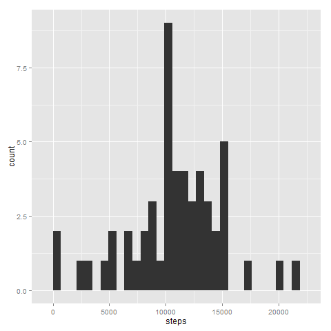
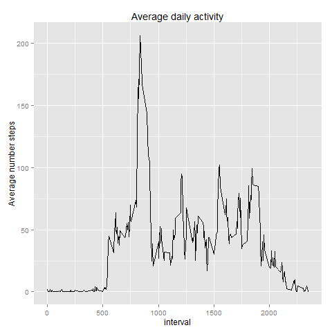
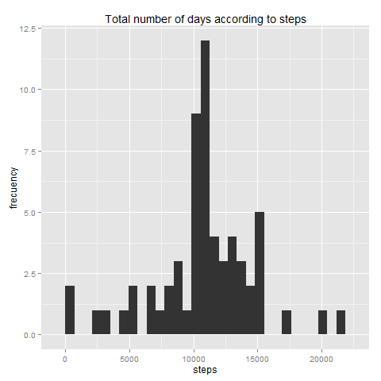
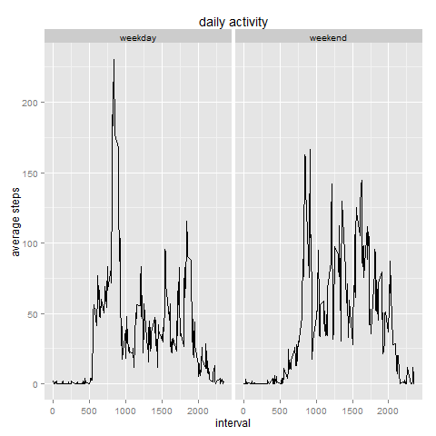

# Reproducible Research. Peer Assessment 1
========================================================

R Markdown document for the Peer Assessment 1.  
Part of the course "Reproducible Research".

## Introduction
This assignment makes use of data from a personal activity monitoring  device. This device collects data at 5 minute intervals through out the day.

The data for this assignment can be downloaded from the [course web site] (https://d396qusza40orc.cloudfront.net/repdata%2Fdata%2Factivity.zip).  


## Loading and preprocessing the data

**Unload & unzip**

```r
setwd("~/R")
fileURL <- "https://d396qusza40orc.cloudfront.net/repdata%2Fdata%2Factivity.zip"
download.file(fileURL, destfile = "~/R/data.zip")
```

```
## Error: esquema de URL sin soporte
```

```r
unzip("data.zip")
```


**Read & explore**

```r
data.act <- read.csv("activity.csv", nrows = 17569)  # import the file w/o changes
```

These commands will be used repeatedly throughout the work

```r
head(data.act)
```

```
##   steps       date interval
## 1    NA 2012-10-01        0
## 2    NA 2012-10-01        5
## 3    NA 2012-10-01       10
## 4    NA 2012-10-01       15
## 5    NA 2012-10-01       20
## 6    NA 2012-10-01       25
```

```r
tail(data.act)
```

```
##       steps       date interval
## 17563    NA 2012-11-30     2330
## 17564    NA 2012-11-30     2335
## 17565    NA 2012-11-30     2340
## 17566    NA 2012-11-30     2345
## 17567    NA 2012-11-30     2350
## 17568    NA 2012-11-30     2355
```

```r
summary(data.act)
```

```
##      steps               date          interval   
##  Min.   :  0.0   2012-10-01:  288   Min.   :   0  
##  1st Qu.:  0.0   2012-10-02:  288   1st Qu.: 589  
##  Median :  0.0   2012-10-03:  288   Median :1178  
##  Mean   : 37.4   2012-10-04:  288   Mean   :1178  
##  3rd Qu.: 12.0   2012-10-05:  288   3rd Qu.:1766  
##  Max.   :806.0   2012-10-06:  288   Max.   :2355  
##  NA's   :2304    (Other)   :15840
```

```r
str(data.act)
```

```
## 'data.frame':	17568 obs. of  3 variables:
##  $ steps   : int  NA NA NA NA NA NA NA NA NA NA ...
##  $ date    : Factor w/ 61 levels "2012-10-01","2012-10-02",..: 1 1 1 1 1 1 1 1 1 1 ...
##  $ interval: int  0 5 10 15 20 25 30 35 40 45 ...
```


**Creates a new dataframe**  
accumulated steps per date

```r
steps.date <- aggregate(steps ~ date, data.act, sum)
```


## What is mean total number of steps taken per day?

**Make a histogram of the total number of steps taken each day**  
clarification: x = total number of steps per day, y = frequency)

```r
library(ggplot2)
ggplot(steps.date, aes(x = steps)) + geom_histogram()
```

```
## stat_bin: binwidth defaulted to range/30. Use 'binwidth = x' to adjust this.
```

 


**Calculate and report the mean and median total number of steps taken per day**

```r
paste("The mean is", round(mean(steps.date$steps), 2), "steps per day")
```

```
## [1] "The mean is 10766.19 steps per day"
```

```r
paste("The median is", median(steps.date$steps), "steps per day")
```

```
## [1] "The median is 10765 steps per day"
```


## What is the average daily activity pattern?  

**Make a time series plot of 5-minute interval and the average of steps taken, averaged across all days**

```r
steps.interval <- aggregate(steps ~ interval, data.act, mean)
ggplot(steps.interval, aes(x = interval, y = steps)) + geom_line() + ggtitle("Average daily activity") + 
    ylab("Average number steps")
```

 


**Which 5-minute interval, on average across all the days in the dataset contains the maximum number of steps?**

```r
paste("The highest number of steps corresponds to the interval", steps.interval[which.max(steps.interval$steps), 
    ][, 1], "with", round(steps.interval[which.max(steps.interval$steps), ][, 
    2], 2), "steps")
```

```
## [1] "The highest number of steps corresponds to the interval 835 with 206.17 steps"
```


## Imputing missing values

**Calculate and report the total number of missing values**

```r
paste("There are", sum(is.na(data.act$steps)), "rows with NA steps")
```

```
## [1] "There are 2304 rows with NA steps"
```

```r
paste("There is", sum(is.na(data.act$date)), "rows with NA dates")
```

```
## [1] "There is 0 rows with NA dates"
```

```r
paste("There is", sum(is.na(data.act$interval)), "rows with NA intervals")
```

```
## [1] "There is 0 rows with NA intervals"
```


**Devise a strategy for filling in all of the missing values in the dataset**  
strategy: replace NA values with the mean value of the same interval  
  
join two datasets by the variable "interval"

```r
fill.data <- merge(data.act, steps.interval, by = "interval", sort = FALSE)
```


rename column names

```r
colnames(fill.data) <- c("interval", "steps", "date", "mean.steps.interval")
```


**Create a new dataset that is equal to the original dataset but with the NA values filled in**

```r
fill.data$steps[is.na(fill.data$steps)] <- fill.data$mean.steps.interval[is.na(fill.data$steps)]
```


clean dataframe, erase last column (optional)

```r
fill.data$mean.steps.interval <- NULL
```


**Make a histogram of the total number of steps taken each day**

```r
fill.steps.date <- aggregate(steps ~ date, fill.data, sum)
ggplot(fill.steps.date, aes(x = steps)) + geom_histogram() + ggtitle("Total number of days according to steps") + 
    ylab("frecuency")
```

```
## stat_bin: binwidth defaulted to range/30. Use 'binwidth = x' to adjust this.
```

 


**Calculate and report the mean and median total number of steps taken per day**

```r
paste("The new mean is", round(mean(fill.steps.date$steps), 2), "steps by day")
```

```
## [1] "The new mean is 10766.19 steps by day"
```

```r
paste("The new median is", round(median(fill.steps.date$steps), 2), "steps by day")
```

```
## [1] "The new median is 10766.19 steps by day"
```


**Do these values differ from the estimates from the first part of the assignment?**  
The difference between the new and old mean is:

```r
paste("Old - New mean is equal to", round(mean(steps.date$steps) - mean(fill.steps.date$steps), 
    2))
```

```
## [1] "Old - New mean is equal to 0"
```


The difference between the new and old median is:

```r
paste("Old - New median is equal to", round(median(steps.date$steps) - median(fill.steps.date$steps), 
    2))
```

```
## [1] "Old - New median is equal to -1.19"
```


**What is the impact of imputing missing data on the estimates of the total daily number of steps?**  
We observe that the mean no changes and the new median is larger than the last, approaching the mean


## Are there differences in activity patterns between weekdays and weekends?

**Create dataset with the new factor**

```r
day.data <- fill.data  # duplicate dataset (optional)
day.data$days <- as.factor(weekdays(as.Date(day.data$date)))  # creates new factor
levels(day.data$days) <- list(weekday = c("lunes", "martes", "miércoles", "jueves", 
    "viernes"), weekend = c("sábado", "domingo"))  # fix levels of the new factor
```

*The names of the list depends de local language,*
*alternatively, it can be fixed to english with*
*Sys.setlocale("LC_TIME", "English") and the list is in english words.*

**Make a panel plot of the 5-minute interval (x-axis) and the average number of steps taken**


```r
library(ggplot2)
week.data <- aggregate(steps ~ interval + days, day.data, mean)
p <- ggplot(week.data, aes(x = interval, y = steps)) + geom_line() + ylab("average steps") + 
    ggtitle("daily activity")
p + facet_grid(. ~ days)
```

 

We can see that there are different patterns of behavior, associated, probably, with work schedules.
